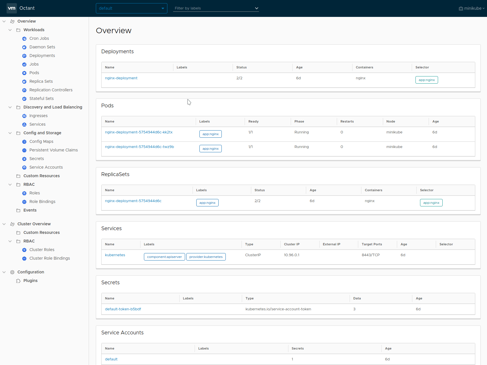

# :eight_pointed_black_star: Octant <!-- Future Logo -->

> A web-based, highly extensible platform for developers to better understand the complexity of Kubernetes clusters.

| [Features](#triangular_ruler-featuress) | [Usage](#hammer_and_wrench-usage) | [Installation](#minidisc-installationn) | [Getting Started](#open_file_folder-getting-started) | [Plugins](#electric_plug-plugins) | [Discussion](#mega-discussion) | [Contributing](#shipit-contributing) | [License](#page_facing_up-license) |
|---|---|---|---|---|---|---|---|

## :triangular_ruler: Features

* **Resource Viewer**

    Graphically visualizate relationships between objects in a Kubernetes cluster. The status of individual objects are represented by color to show workload performance.

* **Summary View**

    Consolidated status and configuration information in a single page aggregated from output typically found using multiple kubectl commands.

* **Port Forward**

    Forward a local port to a running pod with a single button for debugging applications and even port forward multiple pods across namespaces.
 
* **Log Stream**

    View log streams of pod and container activity for troubleshooting or monitoring without holding multiple terminals open.

* **Label Filter**

    Organize workloads with label filtering for inspecting clusters with a high volume of objects in a namespace.

* **Cluster Navigation**

   Easily change between namespaces or contexts across different clusters. Multiple kubeconfig files are also supported.

 * **Plugin System**

   Highly extensible plugin system for users to provide additional functionality through gRPC. Plugin authors can add components on top of existing views.

## :hammer_and_wrench: Usage



## :minidisc: Installation

<!-- TODO: brew and choco install -->

### Download a Prebuilt Binary

1. Open the [releases page](https://github.com/vmware/octant/releases) from a browser and download the latest tarball.

2. Extract the tarball:

    ```sh
    $ tar -xzvf ~/Downloads/octant_0.3.0_Linux-64bit.tar.gz
    octant_0.3.0_Linux-64bit/README.md
    octant_0.3.0_Linux-64bit/octant
    ```

3. Verify it runs:

    ```sh
    $ ./octant_0.3.0_Linux-64bit/octant version
    ```

## :open_file_folder: Getting Started

Before starting Octant, make sure you have access to a healthy cluster. If kubectl is installed, test using `kubectl cluster-info`.

Start running Octant:

`$ octant`

### Environment Variables

Octant is configurable through environment variables defined at runtime.

* `KUBECONFIG` - set to non-empty location if you want to set KUBECONFIG with an environment variable.
* `OCTANT_DISABLE_OPEN_BROWSER` - set to a non-empty value if you don't the browser launched when the dashboard start up.
* `OCTANT_LISTENER_ADDR` - set to address you want dashboard service to start on. (e.g. `localhost:8080`)
* `OCTANT_VERBOSE_CACHE` - set to a non-empty value to view cache actions
* `OCTANT_LOCAL_CONTENT` - set to a directory and dash will serve content responses from here. An example directory lives in `examples/content`
* `OCTANT_PLUGIN_PATH` - add a plugin directory or multiple directories separated by `:`. Plugins will load by default from `$HOME/.config/vmdash/plugins`

**Note:** If using [fish shell](https://fishshell.com), tilde expansion may not occur when using `env` to set environment variables.

### Setting Up a Development Environment

* Go 1.11
* npm 6.4.1 or higher
* [yarn](https://yarnpkg.com)
* [rice](https://github.com/GeertJohan/go.rice) - packaging web assets into a binary
* [mockgen](https://github.com/golang/gomock) - generating go files used for testing
* [protoc](https://github.com/golang/protobuf) - generate go code compatible with gRPC

These build tools can be installed via Makefile with `make go-install`.

A development binary can be built by `make octant-dev`.

For UI changes, see the [README](web) located in `web/`.

If Docker and [Drone](docs/drone.md) is installed, tests and build steps can run in a containerized environment.

## :electric_plug: Plugins

Plugins are a core part of Octant in the Kubernetes ecosystem. A plugin can read objects and allows users to add components to Octant's views.

An example plugin can be found in [`cmd/pluginstub`](cmd/pluginstub) and installed to the default plugin path with `make install-test-plugin`. This creates a `vmdash` directory in `$HOME/.config` where Octant will look for plugin binaries by default.

Documentation for plugin components can be found in [`docs/plugins`](docs/plugins).

## :mega: Discussion

Feature requests, bug reports, and enhancements are welcome. Contributors, maintainers, and users are encouraged to collaborate through these communication channels:

 - [Twitter](https://twitter.com/projectoctant)
 - [Google group](https://groups.google.com/forum/#!forum/octant-dashboard/)
 - [Github issues](https://github.com/vmware/octant/issues)

## :shipit: Contributing

New contributors will need to sign a contributor license agreement before code changes can be merged. Follow the instructions given by `vmwclabot` after opening a pull request.

Pull requests should also include a changelog with the naming convention described [here](CONTRIBUTING.md).

See our [roadmap]() for tentative features in a 1.0 release.

## :page_facing_up: License

Octant is available under the [Apache License, Version 2.0](LICENSE)
